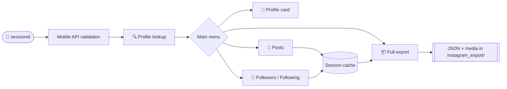

<div align="center">


### 🕷️ Developed by **Krish Ghosh** &nbsp;|&nbsp; *Your friendly Neighbourhood Hacker*

<br>

```
███████╗██████╗ ███████╗ ██████╗████████╗██████╗  █████╗
██╔════╝██╔══██╗██╔════╝██╔════╝╚══██╔══╝██╔══██╗██╔══██╗
███████╗██████╔╝█████╗  ██║        ██║   ██████╔╝███████║
╚════██║██╔═══╝ ██╔══╝  ██║        ██║   ██╔══██╗██╔══██║
███████║██║     ███████╗╚██████╗   ██║   ██║  ██║██║  ██║
╚══════╝╚═╝     ╚══════╝ ╚═════╝   ╚═╝   ╚═╝  ╚═╝╚═╝  ╚═╝
```

<a href="https://github.com/subzeroid/instagrapi">
  
</a>

<br>

**A fast, beautiful terminal toolkit to inspect and export Instagram profile data through the mobile API.**

<br>

[](https://www.python.org/)
[](https://github.com/subzeroid/instagrapi)
[](#-requirements)
[](#-license)

[](#-features)
[](#-roadmap)
[](#-contributing)
[](#-author)
[](#-roadmap)

<br>

[⚡ Quick Start](#-quick-start) ·
[✨ Features](#-features) ·
[🎮 Usage](#-usage) ·
[📁 Output](#-export-output) ·
[⚙️ Config](#-configuration) ·
[🛠️ Troubleshooting](#-troubleshooting) ·
[⚖️ Disclaimer](#-legal-disclaimer)

</div>

---

## ⚡ Quick Start

```bash
# 1. Get the code
git clone https://github.com/yourusername/Spectra.git
cd Spectra

# 2. Install / update dependencies
python3 -m pip install -U instagrapi requests

# 3. Run
python3 Spectra.py
```

> [!TIP]
> On Windows use `py -m pip install -U instagrapi requests` and `py Spectra.py` if `python3` is not recognised.

That's it. Paste your `sessionid` when asked (see [Getting Your Session ID](#-getting-your-session-id)), enter a username, and pick an option from the menu.

---

## 📖 Table of Contents

<details>
<summary><b>Click to expand</b></summary>

- [Quick Start](#-quick-start)
- [Overview](#-overview)
- [Features](#-features)
- [Preview](#-preview)
- [How It Works](#-how-it-works)
- [Requirements](#-requirements)
- [Installation](#-installation)
- [Getting Your Session ID](#-getting-your-session-id)
- [Usage](#-usage)
- [Menu Reference](#-menu-reference)
- [Export Output](#-export-output)
- [Configuration](#-configuration)
- [Understanding the Terminal UI](#-understanding-the-terminal-ui)
- [Troubleshooting](#-troubleshooting)
- [FAQ](#-faq)
- [Project Structure](#-project-structure)
- [Roadmap](#-roadmap)
- [Contributing](#-contributing)
- [Security & Privacy](#-security--privacy)
- [Legal Disclaimer](#-legal-disclaimer)
- [License](#-license)
- [Author](#-author)
- [Acknowledgements](#-acknowledgements)

</details>

---

## ✨ Overview

**Spectra** is an interactive command-line application built on [`instagrapi`](https://github.com/subzeroid/instagrapi). It signs in with an existing Instagram session, looks up a profile, and lets you browse or export everything the mobile API exposes: profile details, posts with permalinks, follower and following lists, and downloadable media — all wrapped in a clean, gradient-styled terminal UI instead of a wall of plain text.

It's built to feel great in the terminal:

- 🌈 A **gradient ASCII banner** and a modern **truecolor** interface
- ⏳ **Live progress bars** and spinners for every long operation
- 🧠 **Smart caching**, so data is fetched once per session
- ✅ **Integrity checks** that compare fetched data against what Instagram reports
- 📦 A **complete structured export** (JSON + media) in one menu action

> [!IMPORTANT]
> Spectra is intended for use with **your own account** or an account you are **explicitly authorized** to use. Please read the [Legal Disclaimer](#-legal-disclaimer) before use.

---

## 🚀 Features

| | Feature | Description |
|---|---|---|
| 👤 | **Profile inspector** | Username, name, user ID, bio, external link, post/follower/following counts, and verified / private / business badges |
| 🖼️ | **Profile picture** | View the direct URL or download the image |
| 📸 | **Post browser** | Every post with ID, media type, likes, comments, date, permalink, and caption preview |
| 👥 | **Followers list** | Paginated fetch with a live progress bar and formatted table |
| ➕ | **Following list** | Same for accounts the profile follows |
| 📦 | **Full export** | One action writes profile, followers, following, posts, images, and videos to disk |
| ✅ | **Integrity check** | Compares fetched counts to reported counts and flags mismatches |
| 🎨 | **Rich terminal UI** | Truecolor gradients, rounded boxes, spinners, progress bars, ANSI-aware alignment |
| 🧠 | **Session cache** | Followers, following, and posts are fetched once and reused |
| 🛡️ | **Compatibility fallback** | Falls back to `user_medias`, `user_followers_v1`, `user_following_v1` if `iter_*` helpers are missing in your `instagrapi` version |
| 🪟 | **Cross-platform** | Windows 10+, macOS, and Linux |

---

## 🖥️ Preview

<!--
Optional: add your own screenshots to an /assets folder and uncomment.

<p align="center">
  
  
</p>
-->

**Startup**

```
 ███████╗██████╗ ███████╗ ██████╗████████╗██████╗  █████╗
 ██╔════╝██╔══██╗██╔════╝██╔════╝╚══██╔══╝██╔══██╗██╔══██╗
 ███████╗██████╔╝█████╗  ██║        ██║   ██████╔╝███████║
 ╚════██║██╔═══╝ ██╔══╝  ██║        ██║   ██╔══██╗██╔══██║
 ███████║██║     ███████╗╚██████╗   ██║   ██║  ██║██║  ██║
 ╚══════╝╚═╝     ╚══════╝ ╚═════╝   ╚═╝   ╚═╝  ╚═╝╚═╝  ╚═╝

 ━━━━━━━━━━━━━━━━━━━━━━━━━━━━━━━━━━━━━━━━━━━━━━━━━━━━━━━━━━━━━━━━━
          Instagram Profile Toolkit  ·  mobile API edition
  Developed by Krish Ghosh  |  Your friendly Neighbourhood Hacker
 ━━━━━━━━━━━━━━━━━━━━━━━━━━━━━━━━━━━━━━━━━━━━━━━━━━━━━━━━━━━━━━━━━
```

**Main menu**

```
╭────────────────── MAIN MENU · @your_username ──────────────────╮
│ [1]  Profile information                                       │
│ [2]  Profile picture URL                                       │
│ [3]  All posts + links                                         │
│ [4]  All followers                                             │
│ [5]  All following                                             │
│ [6]  Open Instagram profile                                    │
│ [7]  Download ALL details                                      │
│ [8]  Full terminal report                                      │
├────────────────────────────────────────────────────────────────┤
│ [0]  Exit                                                      │
╰────────────────────────────────────────────────────────────────╯
```

**Live progress**

```
[*] Fetching followers using mobile API...
Followers  ████████████████████████░░░░  170/198   85.9%
```

**Followers table**

```
    #  USERNAME                       NAME                         FLAGS
────────────────────────────────────────────────────────────────────────────
    1  @example_user_one              Example One
    2  @example_user_two              Example Two                  ●
    3  @example_user_three            Example Three                ✔ ●
```

**Export summary**

```
╭──────────────────── EXPORT COMPLETED ────────────────────╮
│                    fetched / reported                    │
├──────────────────────────────────────────────────────────┤
│ Followers   170 / 198 ≠                                  │
│ Following   328 / 331 ≠                                  │
│ Posts       1 / 1 ✔                                      │
├──────────────────────────────────────────────────────────┤
│ Saved to instagram_export/your_username                  │
╰──────────────────────────────────────────────────────────╯
```

---

## 🧩 How It Works



1. **Authenticate**: your `sessionid` is validated against the private mobile API (not just public endpoints).
2. **Look up** the target username.
3. **Browse** from the menu. Anything fetched is cached in memory.
4. **Export** reuses the cache, writes JSON, downloads media, and produces an integrity report.

---

## 📋 Requirements

| Requirement | Details |
|---|---|
| **Python** | 3.9 or newer |
| **Packages** | `instagrapi`, `requests` |
| **Terminal** | A **truecolor (24-bit)** terminal for the full gradient experience |
| **Instagram account** | A valid logged-in session (see [Getting Your Session ID](#-getting-your-session-id)) |

**Recommended terminals**

- **Windows:** Windows Terminal, VS Code integrated terminal
- **macOS:** iTerm2, Terminal.app, Warp, Kitty
- **Linux:** GNOME Terminal, Konsole, Alacritty, Kitty, xfce4-terminal, VS Code

> [!NOTE]
> The legacy Windows `cmd.exe` console doesn't render truecolor gradients correctly. Use Windows Terminal.

---

## 📦 Installation

**1. Clone the repository**

```bash
git clone https://github.com/yourusername/Spectra.git
cd Spectra
```

**2. (Recommended) Create a virtual environment**

```bash
# Linux / macOS
python3 -m venv venv
source venv/bin/activate

# Windows (PowerShell)
python -m venv venv
venv\Scripts\Activate.ps1
```

**3. Install dependencies**

```bash
python3 -m pip install -U instagrapi requests
```

The `-U` flag upgrades to the latest versions, which helps avoid API compatibility issues.

**4. Run**

```bash
python3 Spectra.py
```

---

## 🔑 Getting Your Session ID

Spectra authenticates with your Instagram **`sessionid`** cookie. It never asks for your password.

1. Log in to **[instagram.com](https://www.instagram.com)** in your desktop browser using your own account.
2. Open **Developer Tools** (`F12`, or `Ctrl+Shift+I` / `Cmd+Option+I`).
3. Go to the **Application** tab (Chrome / Edge) or **Storage** tab (Firefox).
4. Expand **Cookies** and select `https://www.instagram.com`.
5. Find the cookie named **`sessionid`** and copy its **Value**.
6. Paste it when Spectra prompts you.

> [!WARNING]
> **Treat your `sessionid` like a password.** Anyone who has it can act as your account. Never share it, never paste it into an issue, and never commit it to Git. Logging out of Instagram in the browser invalidates it.

---

## 🎮 Usage

```bash
python3 Spectra.py
```

**Flow**

1. The banner loads and the authorized-use notice appears.
2. Paste your `sessionid`. Spectra validates it against the **mobile API** and shows the logged-in account.
3. Enter the **username** you want to inspect (`@` is optional).
4. Choose actions from the **main menu**. Fetched data is cached, so opening followers twice does not re-download.

**Example session**

```text
❯ Enter sessionid: ********
✓ Session accepted
✓ Logged in as @your_username

❯ Enter Instagram username: your_username
✓ Profile found

❯ Select option: 7
[!] Full export may take time for large accounts.
[*] Export directory: instagram_export/your_username
[✓] profile.json saved
[✓] followers.json saved (170 fetched)
...
```

> [!NOTE]
> Private profiles can only be read if the authenticated account is already approved to view them. Spectra does not and cannot bypass Instagram's access controls.

---

## 🧭 Menu Reference

| Key | Action | What it does |
|:---:|---|---|
| `1` | **Profile information** | Formatted profile card with stats, badges, link, and wrapped bio |
| `2` | **Profile picture URL** | Prints the direct profile picture URL |
| `3` | **All posts + links** | Fetches every post and lists ID, type, likes, comments, date, permalink, caption preview |
| `4` | **All followers** | Fetches followers with live progress and displays a table with flags |
| `5` | **All following** | Same for the following list |
| `6` | **Open Instagram profile** | Prints the URL and opens it in your default browser |
| `7` | **Download ALL details** | Runs the full export (see [Export Output](#-export-output)) |
| `8` | **Full terminal report** | Prints profile, posts, followers, and following in one go |
| `0` | **Exit** | Closes Spectra |

---

## 📁 Export Output

Option **7** creates one folder per profile inside `instagram_export/`:

```text
instagram_export/
└── <username>/
    ├── profile.json              # Full profile object
    ├── profile_picture.jpg       # Downloaded profile picture
    ├── profile_picture_url.txt   # Direct picture URL
    ├── followers.json            # All fetched followers
    ├── following.json            # All fetched following
    ├── posts.json                # All fetched post metadata
    ├── data_summary.json         # Export report + integrity check
    └── posts/                    # Downloaded photos, videos, album items
```

### `data_summary.json`

A machine-readable report showing whether the fetched data matches what the profile reports:

```json
{
    "export_time": "2026-09-24T21:11:03.412881",
    "username": "your_username",
    "user_id": "1234567890",
    "reported_by_profile": {
        "followers": 198,
        "following": 331,
        "posts": 1
    },
    "actually_fetched": {
        "followers": 170,
        "following": 328,
        "posts": 1
    },
    "complete_match": {
        "followers": false,
        "following": false,
        "posts": true
    },
    "directory": "instagram_export/your_username"
}
```

### Supported media types

| Type | Value | Downloader |
|---|:---:|---|
| Photo | `1` | `photo_download` |
| Video / Reel | `2` | `video_download` |
| Album / Carousel | `8` | `album_download` |

---

## ⚙️ Configuration

All settings live in the **CONFIG** section at the top of `Spectra.py`.

| Setting | Default | Description |
|---|:---:|---|
| `EXPORT_ROOT` | `Path("instagram_export")` | Base folder for all exports |
| `FOLLOWER_PAGE_SIZE` | `200` | Followers requested per API page |
| `FOLLOWING_PAGE_SIZE` | `200` | Following requested per API page |
| `POST_PAGE_SIZE` | `12` | Posts requested per API page |
| `FOLLOWER_LIMIT` | `0` | Max followers to fetch (`0` = all) |
| `FOLLOWING_LIMIT` | `0` | Max following to fetch (`0` = all) |
| `POST_LIMIT` | `0` | Max posts to fetch (`0` = all) |
| `BOX_WIDTH` | `68` | Width of boxed UI elements |
| `ANIMATE` | `True` | Enables the banner reveal animation |

**Quick test with limited data**

```python
FOLLOWER_LIMIT = 50
FOLLOWING_LIMIT = 50
POST_LIMIT = 10
ANIMATE = False
```

### 🎨 Customising the look

The banner gradient is controlled by `IG_STOPS`, a list of RGB colour stops:

```python
IG_STOPS = [
    (131, 58, 180),   # purple
    (225, 48, 108),   # pink
    (253, 29, 29),    # red
    (252, 176, 69),   # orange
]
```

Swap in any list of RGB tuples for a new theme, for example neon cyan → violet, or a green "hacker" look:

```python
IG_STOPS = [(0, 255, 136), (0, 200, 90), (0, 120, 60)]
```

The banner credit and subtitle are the `CREDIT` and `SUBTITLE` constants just above the `banner()` function.

---

## 🎨 Understanding the Terminal UI

### Flags column

| Symbol | Colour | Meaning |
|:---:|:---:|---|
| `✔` | Green | **Verified** account (blue tick) |
| `●` | Red | **Private** account |
| *(blank)* | | Public, non-verified account |

### Profile badges

| Badge | Meaning |
|---|---|
| `✔ VERIFIED` | Verified account |
| `● PRIVATE` / `● PUBLIC` | Account visibility |
| `◆ BUSINESS` | Business or professional account |

### Integrity marks (export summary)

| Mark | Meaning |
|:---:|---|
| `✔` | Fetched count exactly matches the profile-reported count |
| `≠` | Counts differ. See [Why don't the counts match?](#why-dont-the-counts-match) |

---

## 🛠️ Troubleshooting

| Problem | Likely cause | Fix |
|---|---|---|
| `Authentication failed` | Expired or invalid `sessionid` | Log in to Instagram again and copy a fresh `sessionid` |
| `Mobile API validation failed` | Session works for public lookups but is rejected by private endpoints | Log out and back in on the web, then use the new `sessionid` |
| `Profile lookup failed` | Wrong username, deleted account, or temporary block | Double-check the username; wait a few minutes and retry |
| Fetch stops early / partial lists | Rate limiting or soft throttling | Wait a few minutes and retry; try smaller `*_PAGE_SIZE` values |
| `login_required` / challenge errors | Instagram flagged the session | Open Instagram in your browser, resolve any prompts, get a new `sessionid` |
| Gradients look wrong or plain | Terminal lacks truecolor | Use a modern terminal (see [Requirements](#-requirements)) |
| Boxes (▯) instead of emoji in names | Terminal font has no emoji glyphs | Install an emoji-capable font, e.g. *Noto Color Emoji* |
| Table columns shift on some rows | Emoji and fancy Unicode fonts have variable width | Cosmetic only; data is unaffected |
| `iter_user_*` attribute errors | Older or newer `instagrapi` version | Spectra falls back automatically; also run `python3 -m pip install -U instagrapi requests` |
| `ModuleNotFoundError: instagrapi` | Dependencies not installed | Run `python3 -m pip install -U instagrapi requests` |
| Media download fails for a post | Deleted post, unsupported type, or temporary block | Failures are counted and reported; re-run the export |

### Why don't the counts match?

A `≠` next to followers or following is common and doesn't necessarily mean something went wrong:

- **Deactivated, banned, or restricted accounts.** Instagram's headline count can include accounts the API no longer returns.
- **Pagination interruptions.** Rate limits can end a list early. Waiting and retrying often recovers the missing entries.
- **Count lag.** The number on the profile can be slightly stale compared to the live list.

If the mismatch is large, wait a few minutes and fetch again.

---

## ❓ FAQ

<details>
<summary><b>Do I need to enter my Instagram password?</b></summary>

No. Spectra only asks for your `sessionid` cookie. Your password is never requested or stored.
</details>

<details>
<summary><b>Is my session ID saved anywhere?</b></summary>

No. It's kept in memory for the duration of the run and is not written to disk by Spectra.
</details>

<details>
<summary><b>Can it access private profiles?</b></summary>

Only if the authenticated account already has permission to view them (for example, it's an approved follower). Spectra does not bypass privacy settings.
</details>

<details>
<summary><b>Can my account get restricted?</b></summary>

Any automation against Instagram carries some risk, especially large fetches in a short time. Keep usage moderate, avoid back-to-back exports, and consider the `*_LIMIT` settings.
</details>

<details>
<summary><b>How long does a full export take?</b></summary>

It depends on account size and network conditions. Small accounts finish in seconds; accounts with thousands of followers or many posts take longer, especially with media downloads.
</details>

<details>
<summary><b>Does it work on Windows?</b></summary>

Yes, on Windows 10 and newer. Use Windows Terminal for the best visuals.
</details>

<details>
<summary><b>How do I change the colours?</b></summary>

Edit `IG_STOPS` and the colour constants (`PINK`, `PURPLE`, `CYAN`, and so on) at the top of `Spectra.py`.
</details>

---

## 🗂️ Project Structure

```text
Spectra/
├── Spectra.py           # Main application
├── README.md            # You are here
├── LICENSE              # License text
├── .gitignore           # Keeps exports and secrets out of Git
└── instagram_export/    # Generated at runtime (git-ignored)
```

**Recommended `.gitignore`**

```gitignore
# Exports (contain personal data)
instagram_export/

# Python
__pycache__/
*.pyc
venv/
.venv/

# Secrets and sessions
*.session
session*.json
.env
```

**Inside `Spectra.py`**

| Section | Responsibility |
|---|---|
| CONFIG | User-adjustable limits and appearance |
| COLORS | Truecolor palette and gradient engine |
| TERMINAL HELPERS | Status lines, spinner, progress bar |
| BOXES / LAYOUT | ANSI-aware box drawing |
| BANNER | Gradient ASCII art and credit line |
| SERIALIZER | Converts `instagrapi` objects to JSON-safe data |
| SESSION | Authentication and mobile-API validation |
| PROFILE / POSTS / FOLLOWERS | Fetching and display |
| EXPORT | Full export and summary report |
| MENU / MAIN | Interactive loop with session cache |

---

## 🗺️ Roadmap

- [x] Gradient ASCII banner and truecolor UI
- [x] Progress bars and spinners
- [x] Session cache across menu options
- [x] Integrity check for exported counts
- [x] Automatic fallback for different `instagrapi` versions
- [ ] Configurable request delay to reduce throttling
- [ ] Retry logic for interrupted follower/following fetches
- [ ] Diff mode: compare two exports (new / lost followers)
- [ ] CSV and HTML export formats
- [ ] Pager for long lists
- [ ] Command-line arguments for non-interactive use
- [ ] Optional secure session persistence
- [ ] Theme presets (neon, cyberpunk, hacker-green)

Have an idea? [Open an issue](../../issues) and let's talk.

---

## 🤝 Contributing

Contributions are welcome.

1. **Fork** the repository
2. **Create a branch**: `git checkout -b feature/amazing-idea`
3. **Commit** your changes: `git commit -m "Add amazing idea"`
4. **Push** the branch: `git push origin feature/amazing-idea`
5. **Open a Pull Request**

**Guidelines**

- Keep the code readable and consistent with the existing structure
- Test on at least one platform before submitting
- Never include real session IDs, exports, or personal data in commits, issues, or screenshots
- Describe what changed and why in your PR

**Bug reports** should include your Python version, OS, terminal, `instagrapi` version (`python3 -m pip show instagrapi`), and the full error output with sensitive values removed.

---

## 🔒 Security & Privacy

- Your `sessionid` grants full access to your account. **Never share it or commit it.**
- Exports may contain **personal data about other people** (usernames, names, profile details). Store them securely and don't publish them.
- If you think a session ID has leaked, **log out** of Instagram everywhere and change your password.
- Don't attach exports or screenshots containing real user data to public issues or pull requests.

To report a security concern, open a private security advisory on the repository rather than a public issue.

---

## ⚖️ Legal Disclaimer

This project is provided **for educational and personal-use purposes only**.

- It is **not affiliated with, authorized, maintained, sponsored, or endorsed by Instagram or Meta Platforms, Inc.** Instagram is a trademark of its respective owner.
- It relies on Instagram's **unofficial, private mobile API** through a third-party library. That API can change or break without notice, and using automated tools against Instagram may violate its **Terms of Use** and can lead to rate limits, temporary blocks, or account restrictions.
- Use Spectra **only with accounts you own or are explicitly authorized to access**, and only to view or export data you have the right to access.
- You are solely responsible for how you use this software and for complying with all applicable laws and regulations, including privacy and data-protection laws such as GDPR and CCPA, and Instagram's own policies.
- The author and contributors provide this software **"as is"**, without warranty of any kind, and accept **no liability** for damages, account actions, or legal consequences arising from its use.

---

## 📄 License

Distributed under the **MIT License**. See [`LICENSE`](LICENSE) for details.

```text
MIT License

Copyright (c) 2026 Krish Ghosh

Permission is hereby granted, free of charge, to any person obtaining a copy
of this software and associated documentation files (the "Software"), to deal
in the Software without restriction, including without limitation the rights
to use, copy, modify, merge, publish, distribute, sublicense, and/or sell
copies of the Software, and to permit persons to whom the Software is
furnished to do so, subject to the following conditions:

The above copyright notice and this permission notice shall be included in all
copies or substantial portions of the Software.

THE SOFTWARE IS PROVIDED "AS IS", WITHOUT WARRANTY OF ANY KIND, EXPRESS OR
IMPLIED, INCLUDING BUT NOT LIMITED TO THE WARRANTIES OF MERCHANTABILITY,
FITNESS FOR A PARTICULAR PURPOSE AND NONINFRINGEMENT. IN NO EVENT SHALL THE
AUTHORS OR COPYRIGHT HOLDERS BE LIABLE FOR ANY CLAIM, DAMAGES OR OTHER
LIABILITY, WHETHER IN AN ACTION OF CONTRACT, TORT OR OTHERWISE, ARISING FROM,
OUT OF OR IN CONNECTION WITH THE SOFTWARE OR THE USE OR OTHER DEALINGS IN THE
SOFTWARE.
```

---

## 👨‍💻 Author

<div align="center">

### **Krish Ghosh**
*Your friendly Neighbourhood Hacker* 🕷️

[](https://github.com/yourusername)
[](https://www.instagram.com/krish7ghosh/)

Questions, bugs, or ideas? [Open an issue](../../issues) — feedback and PRs are always welcome.

</div>

---

## 🙏 Acknowledgements

- **[instagrapi](https://github.com/subzeroid/instagrapi)** for the Instagram API client that powers Spectra
- **[Requests](https://requests.readthedocs.io/)** for simple, reliable HTTP
- **[Shields.io](https://shields.io/)**, **[Capsule Render](https://github.com/kyechan99/capsule-render)**, and **[Readme Typing SVG](https://github.com/DenverCoder1/readme-typing-svg)** for the visuals

---

<div align="center">

**If Spectra helped you, drop a ⭐ on the repo**

Made with 💜 and a lot of terminal colours by **Krish Ghosh**


[⬆ Back to top](#)

</div>
